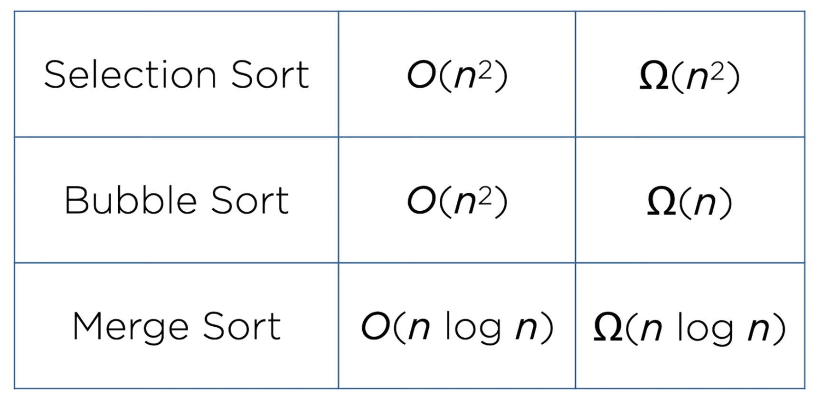
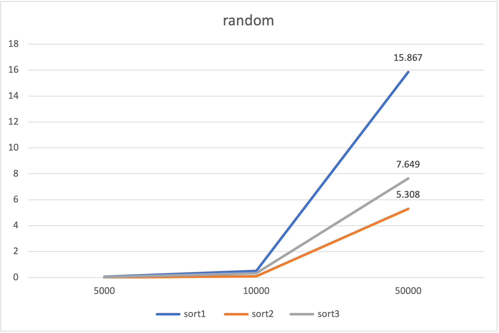
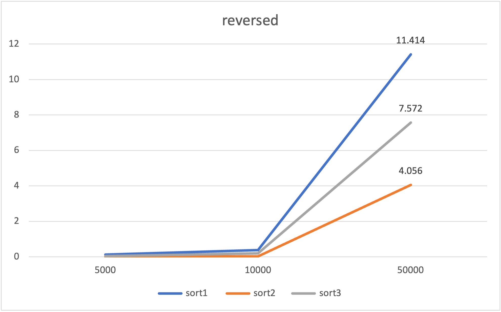
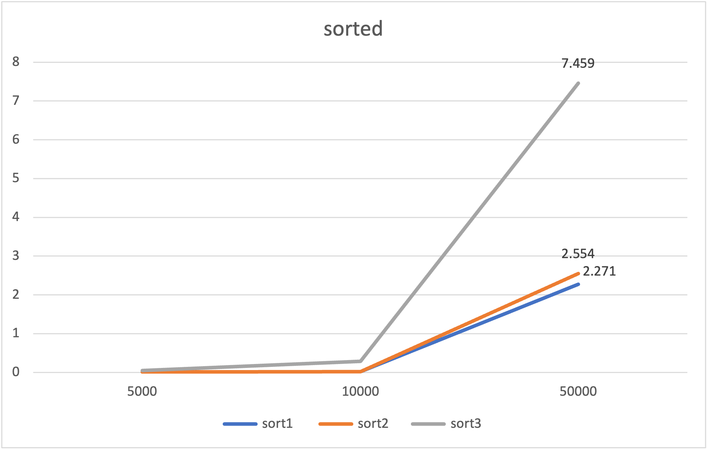

# Big Os

**Selection Sort**
- Would always have the same speed

**Bubble Sort**
- Would be similar to selection in worse case (random)
- In reverse, it should run the same (if not worse than random)
- In sorted, it should be very fast
- Bubble sort would have the highest variation

**Merge sort**
- The fastest in the large dataset

# Sorting exercise

## Table

| source/sort   | sort1   | sort2  | sort3  |
|---------------|---------|--------|--------|
| random5000    | 0.064s  | 0.010s | 0.033s |
| random10000   | 0.504s  | 0.099s | 0.341s |
| random50000   | 15.867s | 5.308s | 7.649s |
| reversed5000  | 0.118s  | 0.015s | 0.040s |
| reversed10000 | 0.371s  | 0.018s | 0.187s |
| reversed50000 | 11.414s | 4.056s | 7.572s |
| sorted5000    | 0.013s  | 0.011s | 0.051s |
| sorted10000   | 0.017s  | 0.024s | 0.284s |
| sorted50000   | 2.271s  | 2.554s | 7.459s |

## Chart

### Random

### Reversed

### Sorted

## Analysis

- Sort 3 must be selection because it takes the longest and similar time when random or revesed
- Sort 1 must be bubble because it has the highest variation, being fastest when sorted, and slowest when random or reversed
- Sort 2 must be merge, since it's time are relatively constant in random and in reverse